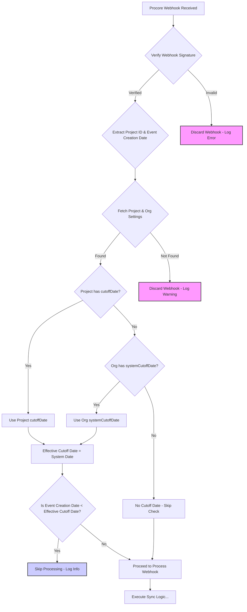

## Overview

To prevent processing excessively old data or data created before a specific migration or go-live date, GLAPI implements a cutoff date mechanism for incoming Procore webhooks. This ensures that only relevant, timely events trigger synchronization actions.

## Cutoff Date Hierarchy

The system uses a hierarchical approach to determine the cutoff date for a specific webhook event associated with a project:

1.  **Project-Specific Cutoff Date**: Each project can have its own `cutoffDate` defined in its settings. This date takes the highest precedence. If a project has a `cutoffDate` set, this date will be used for filtering its webhook events.
2.  **System (Organization) Default Cutoff Date**: If a project does *not* have a specific `cutoffDate` set (i.e., it's `null` or the project setting is configured to "Use System Default"), the system falls back to the `systemCutoffDate` defined in the organization's settings.
3.  **No Cutoff Date**: If neither the project nor the organization has a cutoff date defined, no date-based filtering occurs, and all webhook events for that project will be processed (subject to other validation).

**Note:** When a new project is created in GLAPI, its specific `cutoffDate` is initially set to the project's creation timestamp. It can be explicitly set to `null` (to use the system default) or changed to a different date via the project settings UI.

## Processing Flow

The following diagram illustrates how an incoming Procore webhook event is checked against the relevant cutoff date before processing:

**Steps:**

1.  A webhook arrives from Procore.
2.  The webhook signature is verified.
3.  Relevant information (Procore Project ID, Event Creation Timestamp) is extracted from the payload.
4.  The GLAPI system fetches the corresponding project record from the database, including its `cutoffDate` and the related organization's `systemCutoffDate`.
5.  The system determines the `Effective Cutoff Date` based on the hierarchy (Project > System).
6.  If an `Effective Cutoff Date` exists, the timestamp of the event creation is compared to it.
7.  If the event was created *before* the `Effective Cutoff Date`, processing stops, and the event is skipped.
8.  If the event was created *on or after* the `Effective Cutoff Date` (or if no cutoff date applies), the normal webhook processing logic continues. 