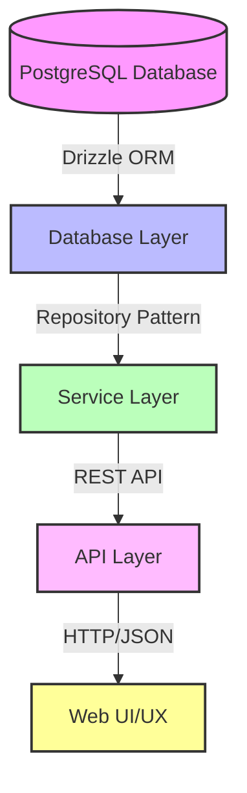
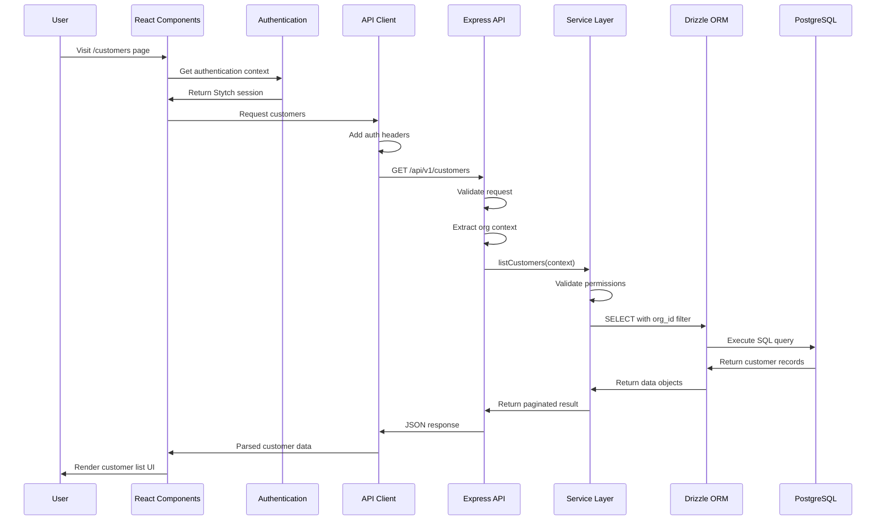

# Data Flow: Database to User Experience

This document describes the flow of data from the database through various layers of the application to the user interface, with a focus on the customer data flow as an example.

## Architecture Overview

GLAPI follows a layered architecture pattern with clear separation of concerns. Each layer has specific responsibilities and communicates only with adjacent layers.

## Detailed Data Flow (Customer Example)

The following diagram illustrates how customer data flows through the system when a user views the customer list page:

## Component Responsibilities

### 1. Database Layer (packages/database)
- Uses Drizzle ORM to interact with PostgreSQL
- Defines database schemas and relationships
- Handles database migrations and connections
- No business logic; purely data access

### 2. Service Layer (packages/api-service)
- Implements business logic and validation
- Enforces organizational boundaries
- Handles complex operations that span multiple entities
- Returns serialized data models
- Organization and data isolation

### 3. API Layer (apps/api)
- Express.js REST API
- Routes and controllers
- Authentication and request validation
- Maps HTTP requests to service calls
- Error handling and response formatting
- CORS and security headers

### 4. API Client (apps/web/src/lib/db-adapter.ts)
- Client-side abstraction for API calls
- Handles authentication headers
- Request/response formatting
- Error handling and retries

### 5. Web UI (apps/web)
- Next.js React application
- Authentication with Stytch
- UI components and state management
- User interactions and form handling
- Client-side validation and error display

## Data Context & Security

A key aspect of the architecture is maintaining organizational context throughout the entire request flow:

1. The user authenticates with Stytch in the web application
2. Their session includes an organization context (Stytch organization ID)
3. API requests include this organization ID in the headers
4. The API middleware translates the Stytch organization ID to an internal organization ID
5. The service layer enforces data isolation using this organizational context
6. Database queries always include organization ID filters

This ensures that users can only access data within their organizational boundary, even if they attempt to manipulate request parameters.

## Example GET Customer Flow

1. User navigates to customer page in the web app
2. React component calls the API client's `customers.getById(id)` method
3. API client adds organization context from authentication
4. Express API receives the request at `/api/v1/customers/:id`
5. API extracts and validates authentication context
6. CustomerService is called with this context
7. Service validates the request and fetches the customer
8. Service ensures the customer belongs to the user's organization
9. Data is returned through the API to the client
10. UI renders the customer information

## Cross-Cutting Concerns

- **Error Handling**: Each layer has appropriate error handling
- **Validation**: Input validation at both API and service levels
- **Logging**: Structured logging at each layer
- **Performance**: Query optimization, pagination, etc.
- **Security**: Authentication, authorization, and data isolation