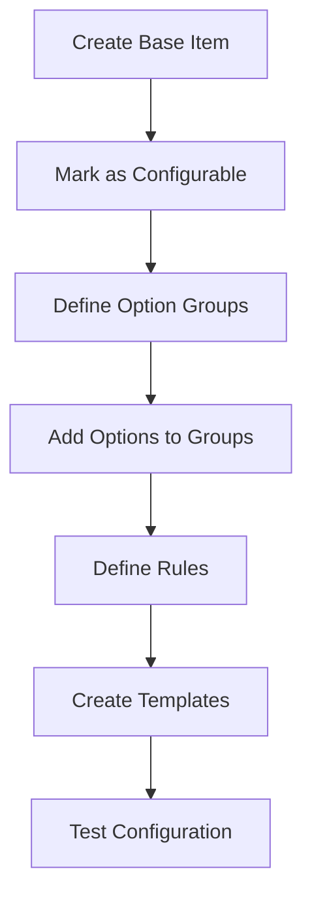
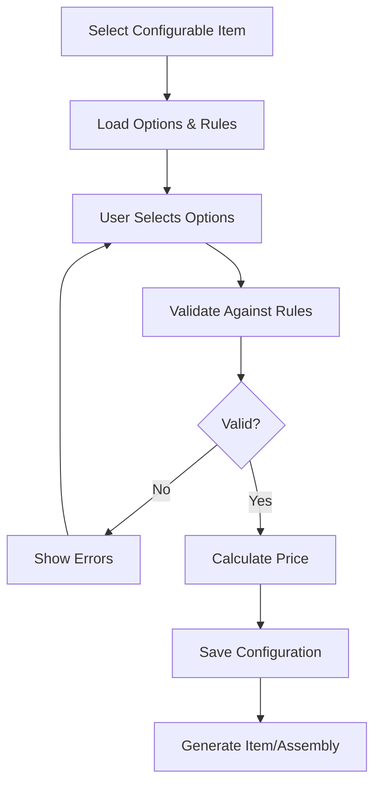

# Configurable Items System Design

## Overview

This document outlines the design for an advanced configurable items system that goes beyond simple matrix/variant items to provide a full product configurator with rules, dependencies, and dynamic pricing.

## Concept

Configurable items allow customers to build custom products by selecting from various options, with rules that:
- Define valid combinations
- Set dependencies between options
- Calculate dynamic pricing
- Generate appropriate BOMs/assemblies
- Validate configurations

## Database Schema

### 1. Configurable Items Table

```sql
CREATE TABLE configurable_items (
  id UUID PRIMARY KEY DEFAULT gen_random_uuid(),
  organization_id UUID NOT NULL REFERENCES organizations(id),
  item_id UUID NOT NULL REFERENCES items(id), -- Base item
  configuration_type VARCHAR(50) CHECK (configuration_type IN (
    'SIMPLE',      -- Basic option selection
    'ASSEMBLY',    -- Generates assembly with BOM
    'KIT',         -- Generates kit with components
    'HYBRID'       -- Mix of assembly and kit components
  )),
  base_price DECIMAL(18,2),
  configuration_data JSONB, -- Additional metadata
  is_active BOOLEAN DEFAULT true,
  created_at TIMESTAMP WITH TIME ZONE DEFAULT CURRENT_TIMESTAMP,
  updated_at TIMESTAMP WITH TIME ZONE DEFAULT CURRENT_TIMESTAMP,
  UNIQUE(organization_id, item_id)
);
```

### 2. Configuration Options Table

```sql
CREATE TABLE configuration_options (
  id UUID PRIMARY KEY DEFAULT gen_random_uuid(),
  configurable_item_id UUID NOT NULL REFERENCES configurable_items(id),
  option_group VARCHAR(100) NOT NULL, -- e.g., "Processor", "Memory", "Color"
  option_code VARCHAR(50) NOT NULL,
  option_name VARCHAR(200) NOT NULL,
  description TEXT,
  
  -- Linked item/component
  item_id UUID REFERENCES items(id), -- Optional linked item
  quantity DECIMAL(18,2) DEFAULT 1,
  
  -- Pricing impact
  price_adjustment DECIMAL(18,2) DEFAULT 0,
  price_adjustment_type VARCHAR(20) DEFAULT 'FIXED' CHECK (
    price_adjustment_type IN ('FIXED', 'PERCENTAGE', 'FORMULA')
  ),
  price_formula TEXT, -- For complex pricing calculations
  
  -- Constraints
  is_required BOOLEAN DEFAULT false,
  is_default BOOLEAN DEFAULT false,
  min_quantity DECIMAL(18,2) DEFAULT 0,
  max_quantity DECIMAL(18,2),
  
  -- Display
  sort_order INTEGER DEFAULT 0,
  display_data JSONB, -- Images, tooltips, etc.
  
  is_active BOOLEAN DEFAULT true,
  created_at TIMESTAMP WITH TIME ZONE DEFAULT CURRENT_TIMESTAMP,
  
  UNIQUE(configurable_item_id, option_group, option_code),
  INDEX idx_config_options_group (configurable_item_id, option_group)
);
```

### 3. Configuration Rules Table

```sql
CREATE TABLE configuration_rules (
  id UUID PRIMARY KEY DEFAULT gen_random_uuid(),
  configurable_item_id UUID NOT NULL REFERENCES configurable_items(id),
  rule_name VARCHAR(200) NOT NULL,
  rule_type VARCHAR(50) NOT NULL CHECK (rule_type IN (
    'REQUIRES',       -- Option A requires option B
    'EXCLUDES',       -- Option A excludes option B
    'MODIFIES_PRICE', -- Option A changes price of option B
    'MODIFIES_QTY',   -- Option A changes quantity of option B
    'CONDITIONAL',    -- Complex conditional logic
    'VALIDATION'      -- Custom validation rule
  )),
  
  -- Rule definition
  source_option_id UUID REFERENCES configuration_options(id),
  source_option_group VARCHAR(100),
  source_condition JSONB, -- e.g., {"operator": ">=", "value": 2}
  
  target_option_id UUID REFERENCES configuration_options(id),
  target_option_group VARCHAR(100),
  target_action JSONB, -- e.g., {"action": "set_price", "value": 100}
  
  -- Complex rules
  rule_expression TEXT, -- For CONDITIONAL type
  error_message TEXT,
  
  priority INTEGER DEFAULT 0, -- Order of rule evaluation
  is_active BOOLEAN DEFAULT true,
  created_at TIMESTAMP WITH TIME ZONE DEFAULT CURRENT_TIMESTAMP,
  
  INDEX idx_config_rules_source (source_option_id),
  INDEX idx_config_rules_priority (configurable_item_id, priority)
);
```

### 4. Configuration Templates Table

```sql
CREATE TABLE configuration_templates (
  id UUID PRIMARY KEY DEFAULT gen_random_uuid(),
  configurable_item_id UUID NOT NULL REFERENCES configurable_items(id),
  template_name VARCHAR(200) NOT NULL,
  description TEXT,
  
  -- Predefined configurations
  selected_options JSONB NOT NULL, -- Array of option selections
  
  -- Pricing
  template_price DECIMAL(18,2), -- Override calculated price
  discount_percentage DECIMAL(5,2),
  
  -- Usage
  is_featured BOOLEAN DEFAULT false,
  usage_count INTEGER DEFAULT 0,
  
  is_active BOOLEAN DEFAULT true,
  created_at TIMESTAMP WITH TIME ZONE DEFAULT CURRENT_TIMESTAMP,
  
  INDEX idx_config_templates_featured (configurable_item_id, is_featured)
);
```

### 5. Configuration Instances Table

```sql
CREATE TABLE configuration_instances (
  id UUID PRIMARY KEY DEFAULT gen_random_uuid(),
  organization_id UUID NOT NULL REFERENCES organizations(id),
  configurable_item_id UUID NOT NULL REFERENCES configurable_items(id),
  
  -- Reference to where this is used
  reference_type VARCHAR(50), -- 'QUOTE', 'ORDER', 'SAVED', etc.
  reference_id UUID,
  
  -- Configuration details
  selected_options JSONB NOT NULL,
  calculated_price DECIMAL(18,2),
  calculated_cost DECIMAL(18,2),
  
  -- Generated item
  generated_item_id UUID REFERENCES items(id),
  generation_status VARCHAR(50),
  
  -- Metadata
  configuration_name VARCHAR(200),
  notes TEXT,
  created_by UUID REFERENCES users(id),
  created_at TIMESTAMP WITH TIME ZONE DEFAULT CURRENT_TIMESTAMP,
  
  INDEX idx_config_instances_reference (reference_type, reference_id)
);
```

## Configuration Rules Engine

### Rule Types and Examples

#### 1. REQUIRES Rule
```json
{
  "rule_type": "REQUIRES",
  "source": {"group": "Graphics", "code": "NVIDIA_RTX"},
  "target": {"group": "Power Supply", "min_code": "PSU_750W"},
  "message": "NVIDIA RTX graphics card requires at least 750W power supply"
}
```

#### 2. EXCLUDES Rule
```json
{
  "rule_type": "EXCLUDES",
  "source": {"group": "Size", "code": "COMPACT"},
  "target": {"group": "Graphics", "codes": ["NVIDIA_RTX", "AMD_RX"]},
  "message": "Compact size cannot accommodate high-end graphics cards"
}
```

#### 3. MODIFIES_PRICE Rule
```json
{
  "rule_type": "MODIFIES_PRICE",
  "source": {"group": "Warranty", "code": "EXTENDED_3YR"},
  "target": {"group": "ALL"},
  "action": {"multiply": 1.15},
  "message": "Extended warranty adds 15% to component prices"
}
```

#### 4. CONDITIONAL Rule
```javascript
{
  "rule_type": "CONDITIONAL",
  "expression": `
    if (options['Memory'] >= 32 && options['Processor'] == 'i9') {
      require('Cooling', 'LIQUID');
      modifyPrice('Assembly', 50);
    }
  `,
  "message": "High-performance configuration requires liquid cooling"
}
```

## TypeScript Interfaces

```typescript
interface ConfigurableItem {
  id: string;
  organizationId: string;
  itemId: string;
  configurationType: 'SIMPLE' | 'ASSEMBLY' | 'KIT' | 'HYBRID';
  basePrice: number;
  configurationData?: any;
  isActive: boolean;
  options?: ConfigurationOption[];
  rules?: ConfigurationRule[];
}

interface ConfigurationOption {
  id: string;
  configurableItemId: string;
  optionGroup: string;
  optionCode: string;
  optionName: string;
  description?: string;
  itemId?: string;
  quantity: number;
  priceAdjustment: number;
  priceAdjustmentType: 'FIXED' | 'PERCENTAGE' | 'FORMULA';
  priceFormula?: string;
  isRequired: boolean;
  isDefault: boolean;
  minQuantity?: number;
  maxQuantity?: number;
  sortOrder: number;
  displayData?: {
    image?: string;
    tooltip?: string;
    helpText?: string;
  };
}

interface ConfigurationRule {
  id: string;
  configurableItemId: string;
  ruleName: string;
  ruleType: 'REQUIRES' | 'EXCLUDES' | 'MODIFIES_PRICE' | 'MODIFIES_QTY' | 'CONDITIONAL' | 'VALIDATION';
  sourceOptionId?: string;
  sourceOptionGroup?: string;
  sourceCondition?: any;
  targetOptionId?: string;
  targetOptionGroup?: string;
  targetAction?: any;
  ruleExpression?: string;
  errorMessage?: string;
  priority: number;
}

interface ConfigurationInstance {
  id: string;
  organizationId: string;
  configurableItemId: string;
  selectedOptions: {
    [groupName: string]: {
      optionId: string;
      quantity?: number;
      customValues?: any;
    }
  };
  calculatedPrice: number;
  calculatedCost: number;
  validationErrors?: string[];
  generatedItemId?: string;
}
```

## Configuration Process Flow

### 1. Configuration Setup (Admin)


### 2. Configuration Usage (User)


## API Endpoints

### Configuration Management

```
# Configurable Items
GET    /api/configurable-items
POST   /api/configurable-items
GET    /api/configurable-items/:id
PUT    /api/configurable-items/:id
DELETE /api/configurable-items/:id

# Options
GET    /api/configurable-items/:id/options
POST   /api/configurable-items/:id/options
PUT    /api/configurable-items/:id/options/:optionId
DELETE /api/configurable-items/:id/options/:optionId

# Rules
GET    /api/configurable-items/:id/rules
POST   /api/configurable-items/:id/rules
PUT    /api/configurable-items/:id/rules/:ruleId
DELETE /api/configurable-items/:id/rules/:ruleId
POST   /api/configurable-items/:id/rules/validate

# Configuration Process
POST   /api/configurations/validate    # Validate a configuration
POST   /api/configurations/calculate   # Calculate price
POST   /api/configurations/save        # Save configuration instance
POST   /api/configurations/generate    # Generate item/assembly
```

## Advanced Features

### 1. Dynamic Pricing Formulas

```javascript
// Example price formula for memory upgrade
function calculateMemoryPrice(basePrice, selectedGB) {
  const pricePerGB = 50;
  const bulkDiscount = selectedGB > 32 ? 0.9 : 1;
  return (selectedGB - 8) * pricePerGB * bulkDiscount;
}
```

### 2. Conditional Visibility

```javascript
// Show RAID options only with multiple drives
{
  "optionGroup": "RAID Configuration",
  "visibilityCondition": {
    "group": "Storage Drives",
    "condition": "count",
    "operator": ">=",
    "value": 2
  }
}
```

### 3. Step-by-Step Configuration

```javascript
// Configuration wizard steps
const configurationSteps = [
  { step: 1, name: "Base Model", groups: ["Model", "Size"] },
  { step: 2, name: "Performance", groups: ["Processor", "Memory", "Graphics"] },
  { step: 3, name: "Storage", groups: ["Storage Drives", "RAID Configuration"] },
  { step: 4, name: "Accessories", groups: ["Monitor", "Keyboard", "Mouse"] },
  { step: 5, name: "Services", groups: ["Warranty", "Support", "Installation"] }
];
```

### 4. Configuration Inheritance

```sql
-- Allow configurations to inherit from templates
CREATE TABLE configuration_inheritance (
  child_config_id UUID REFERENCES configurable_items(id),
  parent_config_id UUID REFERENCES configurable_items(id),
  inheritance_type VARCHAR(50), -- 'OPTIONS', 'RULES', 'BOTH'
  override_rules JSONB
);
```

## Implementation Phases

### Phase 1: Basic Configurator
- Simple option selection
- Basic REQUIRES/EXCLUDES rules
- Fixed price adjustments
- Manual validation

### Phase 2: Advanced Rules
- Complex conditional rules
- Dynamic pricing formulas
- Rule priorities and conflicts
- Automated validation

### Phase 3: Integration
- Generate assemblies/kits
- Integration with quotes/orders
- Configuration templates
- Bulk configuration

### Phase 4: Enhanced UX
- Visual configurator
- 3D preview (future)
- Comparison tools
- Configuration sharing

## Benefits Over Simple Matrix Items

1. **Complex Dependencies**: Handle sophisticated product relationships
2. **Dynamic Pricing**: Calculate prices based on combinations
3. **Validation Rules**: Ensure valid configurations only
4. **Guided Selling**: Help users make valid choices
5. **Scalability**: Handle millions of combinations efficiently
6. **Manufacturing Integration**: Generate accurate BOMs
7. **Customer Experience**: Interactive configuration process

## Use Cases

1. **Computer Systems**: Build-to-order PCs with component validation
2. **Manufacturing Equipment**: Complex machinery with options
3. **Software Licenses**: Feature-based licensing models
4. **Furniture**: Modular furniture with size/color/material options
5. **Vehicles**: Car configurators with trim/option packages
6. **Industrial Products**: Pumps, motors with technical specifications

## Conclusion

This configurable items system provides a powerful differentiator that goes well beyond NetSuite's matrix items, offering true product configuration capabilities with rules, validation, and dynamic pricing. It can start simple and evolve to handle extremely complex configuration scenarios.