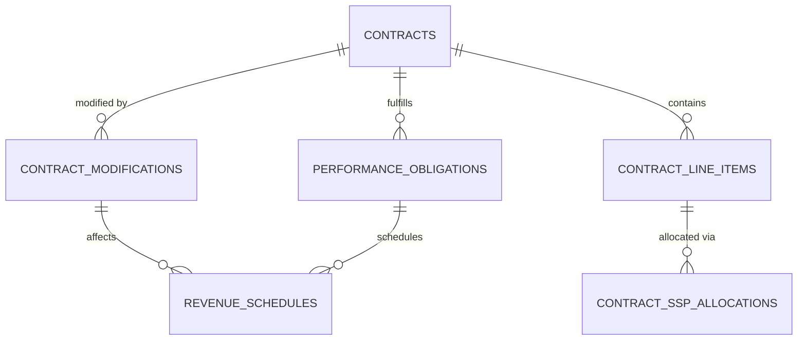

# Contract Modification Example

## Human-Friendly Explanation

### The Problem

Imagine a software company sells a 3-year SaaS subscription to a customer for $300,000, along with implementation services worth $50,000. The contract is signed, and revenue recognition begins. Six months later, the customer wants to:

1. Add additional user licenses, increasing the subscription value by $100,000
2. Add a new module not originally included, costing $75,000
3. Extend the contract period from 3 years to 4 years

This creates a complex accounting challenge: How do we properly account for these changes without incorrectly recognizing revenue or violating revenue recognition principles?

### The Solution

When contract terms change, our system follows a process that ensures accurate revenue recognition:

1. **Analyze the modification**: Determine if this is a separate contract or a modification to the existing one
2. **Calculate adjustment**: If it's a modification, recalculate SSP allocations and update future revenue schedules
3. **Create audit trail**: Document the change and its financial impact
4. **Adjust forecasts**: Update future revenue projections based on the new terms

For our example, the system would:
- Create a contract modification record
- Recalculate the standalone selling prices (SSP) for all items
- Update the remaining revenue recognition schedule for the extended period
- Reallocate the total transaction price based on the new SSP percentages
- Maintain the historical revenue already recognized

## Technical Implementation

### Data Flow

1. **Contract Modification Event**

```typescript
interface ContractModificationRequest {
  contractId: string;
  modificationDate: string; // ISO 8601
  modificationReason: 'upsell' | 'downsell' | 'extension' | 'termination' | 'other';
  updatedLineItems: {
    id?: string; // Existing line item ID if modifying
    productId: string;
    quantity: number; 
    listPrice: number;
    totalPrice: number;
    isNew: boolean; // Whether this is a new line item
  }[];
  contractExtension?: {
    newEndDate: string; // ISO 8601
  };
}
```

2. **Database Operations Sequence**

```sql
-- 1. Create a modification record
INSERT INTO contract_modifications (
  id, contract_id, modification_date, modification_reason, 
  previous_total_value, new_total_value, created_at
) VALUES (...);

-- 2. For each line item:
-- 2a. For existing modified items:
UPDATE contract_line_items 
SET quantity = new_quantity, list_price = new_list_price, total_price = new_total_price
WHERE id = existing_line_item_id;

-- 2b. For new items:
INSERT INTO contract_line_items (
  id, contract_id, product_id, line_item_number, quantity, 
  list_price, total_price, created_at
) VALUES (...);

-- 3. Update contract end date if extended
UPDATE contracts
SET end_date = new_end_date
WHERE id = contract_id;

-- 4. Mark existing schedules as affected by modification
UPDATE revenue_schedules
SET affected_by_modification = TRUE,
    modification_id = new_modification_id
WHERE performance_obligation_id IN (
  SELECT id FROM performance_obligations WHERE contract_id = contract_id
) AND schedule_date > modification_date;
```

3. **Revenue Reallocation Process**

```typescript
// Pseudo-code for the reallocation process
async function reallocateRevenue(contractId: string, modificationId: string) {
  // 1. Get modification details
  const modification = await db.query(`
    SELECT * FROM contract_modifications WHERE id = $1
  `, [modificationId]);
  
  // 2. Calculate new SSP percentages
  const lineItems = await db.query(`
    SELECT * FROM contract_line_items WHERE contract_id = $1
  `, [contractId]);
  
  const totalSSP = lineItems.reduce((sum, item) => sum + item.ssp, 0);
  const allocations = lineItems.map(item => ({
    lineItemId: item.id,
    sspPercentage: item.ssp / totalSSP,
    allocatedAmount: (item.ssp / totalSSP) * modification.new_total_value
  }));
  
  // 3. Store new allocations
  for (const allocation of allocations) {
    await db.query(`
      INSERT INTO contract_ssp_allocations (
        contract_id, line_item_id, allocated_amount, 
        allocation_method, allocation_percentage, created_by
      ) VALUES ($1, $2, $3, 'proportional', $4, $5)
    `, [
      contractId, 
      allocation.lineItemId, 
      allocation.allocatedAmount,
      allocation.sspPercentage,
      'system_modification'
    ]);
  }
  
  // 4. Create new performance obligations for new line items
  // Code to create new POs omitted for brevity
  
  // 5. Generate new revenue schedules
  await generateRevenueSchedules(contractId, modification.modification_date);
}
```

### Database Schema Relationships

For contract modifications, these tables are involved:

1. **contracts**: The main contract record gets updated with new end date/total value
2. **contract_line_items**: Modified and new line items are updated/inserted
3. **contract_modifications**: New record capturing the details of the change
4. **performance_obligations**: New obligations might be created for new products
5. **contract_ssp_allocations**: New allocation records to track the reallocation
6. **revenue_schedules**: Future schedules are recalculated



### User Interface Flow

1. User navigates to contract details page
2. Selects "Modify Contract" action
3. Makes necessary changes to contract (adds/modifies line items, extends dates)
4. System displays a preview of the financial impact:
   - Current recognized revenue (unchanged)
   - Current future revenue schedule
   - Proposed new revenue schedule
   - Delta between original and new schedules
5. User approves the changes
6. System processes the modification and updates all records
7. User receives confirmation with before/after financial summary

## Accounting Treatment

This example follows ASC 606 / IFRS 15 guidelines for contract modifications:

1. If adding distinct goods/services at SSP: Treat as separate contract
2. If replacing remaining goods/services: Terminate old and create new contract
3. If modifying existing contract: Adjust transaction price and reallocate

In our example, we're primarily following approach #3, with partial elements of #1 for the new module.

The system maintains the accounting integrity by:
- Never changing already recognized revenue
- Properly reallocating the transaction price
- Maintaining an audit trail of all modifications
- Ensuring the sum of recognized + to-be-recognized always equals the total contract value