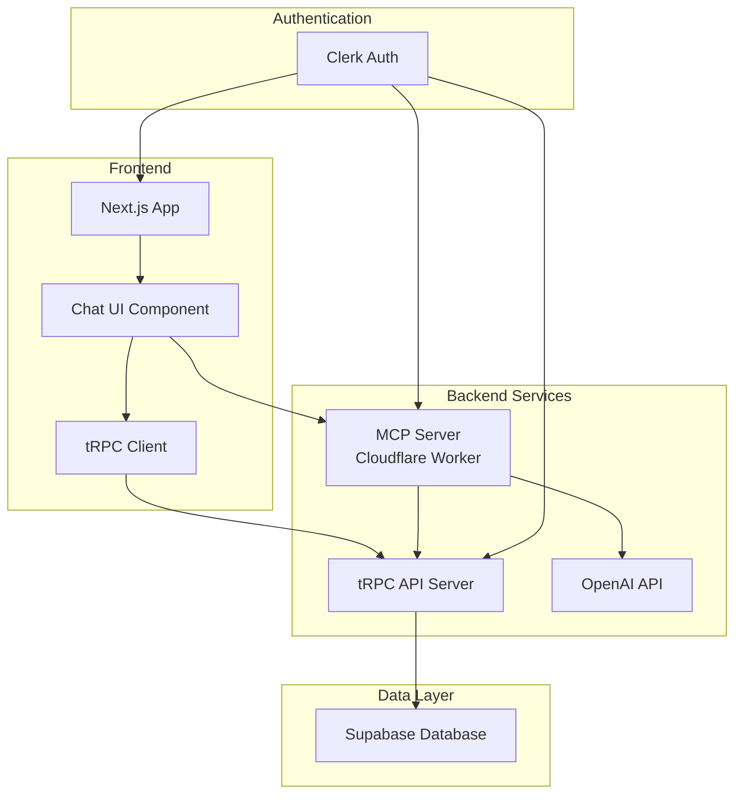

# MCP (Model Context Protocol) Architecture Guide

## Overview

This guide documents the architecture and implementation of the Model Context Protocol (MCP) server integration, enabling AI-powered natural language interactions with your application. This pattern can be replicated across any Next.js + tRPC + Supabase application.

## Table of Contents

1. [Architecture Overview](#architecture-overview)
2. [Core Components](#core-components)
3. [Implementation Guide](#implementation-guide)
4. [Deployment](#deployment)
5. [Best Practices](#best-practices)
6. [Sample Implementation](#sample-implementation)

## Architecture Overview



### Key Technologies

- **Next.js**: Frontend framework with App Router
- **tRPC**: Type-safe API layer
- **Supabase**: PostgreSQL database with Drizzle ORM
- **Cloudflare Workers**: Serverless MCP server hosting
- **OpenAI API**: Natural language processing
- **Clerk**: Authentication and user management
- **MCP Protocol**: JSON-RPC based AI tool protocol

## Core Components

### 1. MCP Server (Cloudflare Worker)

The MCP server acts as the bridge between the AI model and your application's API.

**Key Features:**
- Stateless architecture suitable for edge deployment
- Tool registration system for different operations
- Authentication integration with Clerk
- Type-safe tRPC client for backend communication

**Structure:**
```
packages/mcp-server/
├── src/
│   ├── index.ts           # Cloudflare Worker entry point
│   ├── mcp/
│   │   ├── server.ts      # Core MCP protocol implementation
│   │   ├── auth.ts        # Authentication logic
│   │   └── types.ts       # TypeScript definitions
│   ├── services/
│   │   └── trpc-client.ts # tRPC client for backend
│   └── tools/
│       ├── index.ts       # Tool registration
│       ├── customers.ts   # Customer management tools
│       ├── vendors.ts     # Vendor tools
│       └── ...           # Other entity tools
├── wrangler.toml          # Cloudflare configuration
└── package.json
```

### 2. Chat Interface Component

A React component that provides the UI for AI interactions.

**Key Features:**
- Real-time message streaming
- Tool execution feedback
- Error handling and retry logic
- Message history management

### 3. tRPC API Layer

Type-safe API endpoints that the MCP server calls to perform operations.

**Key Features:**
- Consistent CRUD patterns
- Authentication middleware
- Input validation with Zod
- Error handling

### 4. Database Schema

Structured data models that support AI operations.

**Key Considerations:**
- Consistent entity structure
- Metadata fields for AI-relevant information
- Proper indexing for search operations

## Implementation Guide

### Step 1: Set Up the MCP Server Package

1. Create the package structure:
```bash
mkdir -p packages/mcp-server/src/{mcp,services,tools}
```

2. Install dependencies:
```json
{
  "name": "@your-app/mcp-server",
  "version": "1.0.0",
  "type": "module",
  "scripts": {
    "dev": "wrangler dev",
    "deploy": "wrangler deploy",
    "tail": "wrangler tail"
  },
  "dependencies": {
    "@trpc/client": "^10.45.0",
    "superjson": "^2.2.1",
    "zod": "^3.22.4"
  },
  "devDependencies": {
    "@cloudflare/workers-types": "^4.20240117.0",
    "wrangler": "^3.57.1"
  }
}
```

3. Configure Cloudflare Worker:
```toml
# wrangler.toml
name = "your-app-mcp-server"
main = "src/index.ts"
compatibility_date = "2024-01-01"
node_compat = true

[env.production]
vars = { ENVIRONMENT = "production" }

[[env.production.secrets]]
binding = "CLERK_SECRET_KEY"

[[env.production.secrets]]
binding = "OPENAI_API_KEY"
```

### Step 2: Implement Core MCP Protocol

See `sample/mcp-server-core.ts` for a complete implementation.

### Step 3: Create Entity Tools

Each entity type (customers, vendors, etc.) needs a tool file:

```typescript
// Example structure for entity tools
export function registerEntityTools(server: MCPServer): void {
  server.registerTool({
    name: 'list_entities',
    description: 'Retrieve and search entity records',
    inputSchema: {
      type: 'object',
      properties: {
        search: { type: 'string' },
        status: { type: 'string' },
        limit: { type: 'number' }
      }
    }
  }, async (args, context) => {
    // Implementation
  });
  
  // Add more tools: get, create, update, delete
}
```

### Step 4: Integrate Chat UI

See `sample/chat-component.tsx` for a complete React component.

### Step 5: Set Up tRPC Endpoints

Ensure your tRPC router includes all necessary endpoints:

```typescript
export const entitiesRouter = router({
  list: protectedProcedure.query(async ({ ctx }) => {
    // Implementation
  }),
  get: protectedProcedure
    .input(z.object({ id: z.string() }))
    .query(async ({ ctx, input }) => {
      // Implementation
    }),
  create: protectedProcedure
    .input(createSchema)
    .mutation(async ({ ctx, input }) => {
      // Implementation
    }),
  update: protectedProcedure
    .input(updateSchema)
    .mutation(async ({ ctx, input }) => {
      // Implementation
    }),
  delete: protectedProcedure
    .input(z.object({ id: z.string() }))
    .mutation(async ({ ctx, input }) => {
      // Implementation
    })
});
```

## Deployment

### 1. Deploy MCP Server to Cloudflare

```bash
cd packages/mcp-server
npm run deploy
```

### 2. Environment Variables

Set up the following environment variables:

**MCP Server (Cloudflare):**
- `CLERK_SECRET_KEY`: For authentication
- `GLAPI_API_URL`: Your tRPC API endpoint
- `OPENAI_API_KEY`: For AI processing

**Next.js App:**
- `NEXT_PUBLIC_MCP_SERVER_URL`: Cloudflare Worker URL
- `NEXT_PUBLIC_CLERK_PUBLISHABLE_KEY`: Clerk public key
- `CLERK_SECRET_KEY`: Clerk secret key
- `DATABASE_URL`: Supabase connection string

### 3. Database Setup

Run migrations to set up the required tables:

```bash
npm run db:generate
npm run db:migrate
```

## Best Practices

### 1. Tool Design

- **Specific Names**: Use descriptive tool names like `list_customers` instead of generic `list`
- **Clear Descriptions**: Help the AI understand when to use each tool
- **Consistent Patterns**: Follow the same structure across all entity types
- **Error Messages**: Provide helpful error messages for the AI to relay

### 2. Security

- **Authentication**: Always validate user tokens
- **Authorization**: Check permissions before operations
- **Input Validation**: Validate all inputs with Zod schemas
- **Rate Limiting**: Implement rate limiting on the MCP server

### 3. Performance

- **Stateless Design**: Keep the MCP server stateless for edge deployment
- **Efficient Queries**: Optimize database queries for common operations
- **Caching**: Implement caching where appropriate
- **Batch Operations**: Support batch operations for efficiency

### 4. User Experience

- **Feedback**: Provide real-time feedback during operations
- **Error Recovery**: Handle errors gracefully with retry options
- **Context Preservation**: Maintain conversation context
- **Natural Language**: Support various phrasings for the same operation

## Sample Implementation

Check the `sample/` directory for a complete working example including:

- `sample/mcp-server-core.ts`: Core MCP server implementation
- `sample/chat-component.tsx`: React chat component
- `sample/entity-tools.ts`: Example entity tools
- `sample/trpc-router.ts`: tRPC router example
- `sample/database-schema.ts`: Drizzle schema example

## Troubleshooting

### Common Issues

1. **"Server not initialized" error**
   - The MCP server is stateless, ensure tools don't require initialization
   
2. **Authentication failures**
   - Verify Clerk tokens are being passed correctly
   - Check CORS configuration

3. **Tool execution errors**
   - Ensure tRPC endpoints match tool expectations
   - Verify error handling in tool implementations

4. **Type mismatches**
   - Keep tRPC and tool schemas in sync
   - Use shared types where possible

## Next Steps

1. Customize tools for your specific entities
2. Add domain-specific operations beyond CRUD
3. Implement advanced features like bulk operations
4. Add analytics to track AI usage patterns
5. Create custom prompts for better AI responses

## Resources

- [MCP Protocol Specification](https://modelcontextprotocol.io)
- [Cloudflare Workers Documentation](https://developers.cloudflare.com/workers/)
- [tRPC Documentation](https://trpc.io)
- [Clerk Documentation](https://clerk.com/docs)
- [OpenAI API Reference](https://platform.openai.com/docs)