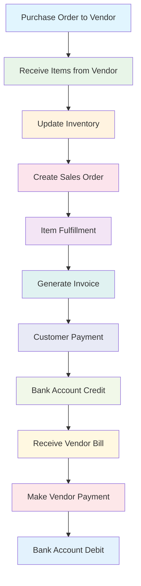
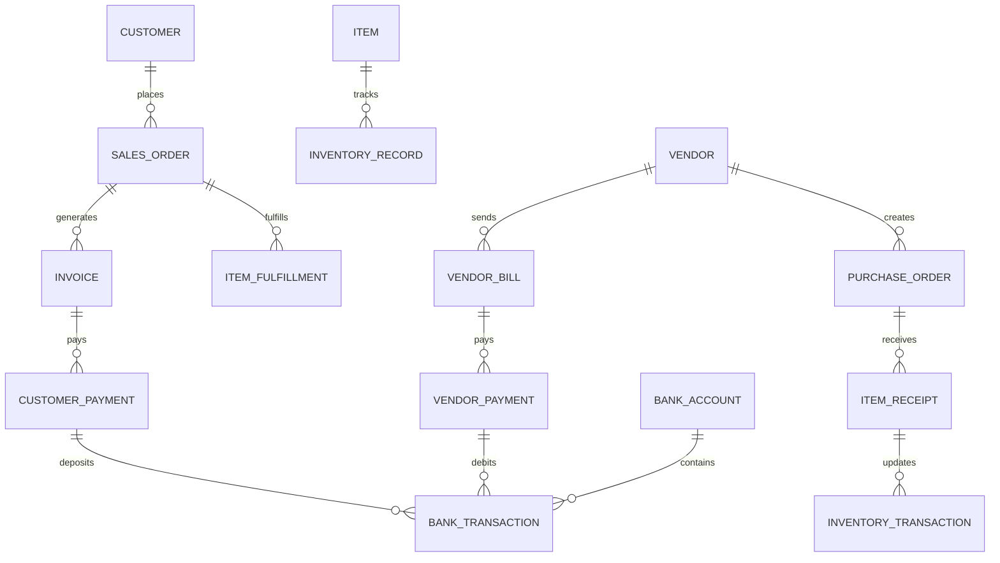

# Order-to-Cash Process Documentation

## Overview

This document outlines the complete end-to-end order-to-cash process in the GLAPI system, from purchasing inventory from vendors to receiving payments from customers and paying vendor bills.

## Process Flow Diagram



## Detailed Process Steps

### Phase 1: Procurement & Inventory Management

#### 1. Purchase Order Creation
- **Entity**: Purchase Order
- **Purpose**: Order inventory from vendors
- **Key Fields**:
  - Vendor ID
  - Items and quantities
  - Expected delivery date
  - Total amount
  - Status (Draft, Sent, Partially Received, Fully Received)

#### 2. Item Receipt
- **Entity**: Item Receipt
- **Purpose**: Record received inventory from vendors
- **Key Fields**:
  - Purchase Order reference
  - Items received with quantities
  - Receipt date
  - Condition notes
- **Impact**: Updates inventory quantities

#### 3. Inventory Tracking
- **Entity**: Inventory Records
- **Purpose**: Track item quantities and locations
- **Key Fields**:
  - Item ID
  - Warehouse/Location
  - Quantity on hand
  - Reserved quantity
  - Available quantity
  - Cost basis (FIFO/LIFO/Average)

### Phase 2: Sales Process

#### 4. Sales Order Creation
- **Entity**: Sales Order
- **Purpose**: Customer order for products/services
- **Key Fields**:
  - Customer ID
  - Items and quantities
  - Pricing (from price lists)
  - Delivery address
  - Status (Draft, Confirmed, Fulfilled, Invoiced)

#### 5. Item Fulfillment
- **Entity**: Item Fulfillment
- **Purpose**: Record shipment of items to customer
- **Key Fields**:
  - Sales Order reference
  - Items shipped with quantities
  - Shipping date
  - Tracking information
  - Warehouse/Location
- **Impact**: Reduces inventory quantities

#### 6. Invoice Generation
- **Entity**: Invoice
- **Purpose**: Bill customer for delivered goods/services
- **Key Fields**:
  - Customer ID
  - Sales Order reference
  - Line items with prices
  - Tax calculations
  - Payment terms
  - Due date
  - Status (Draft, Sent, Paid, Overdue)

### Phase 3: Cash Management

#### 7. Customer Payment
- **Entity**: Customer Payment
- **Purpose**: Record payment received from customer
- **Key Fields**:
  - Customer ID
  - Invoice reference(s)
  - Payment method
  - Amount
  - Payment date
  - Bank account deposited to

#### 8. Bank Account Update
- **Entity**: Bank Transaction
- **Purpose**: Record deposit in bank account
- **Key Fields**:
  - Bank account ID
  - Transaction type (Deposit)
  - Amount
  - Reference (Customer Payment)
  - Date
  - Balance update

### Phase 4: Vendor Payment Process

#### 9. Vendor Bill Receipt
- **Entity**: Vendor Bill
- **Purpose**: Record bill received from vendor
- **Key Fields**:
  - Vendor ID
  - Purchase Order reference
  - Bill date
  - Due date
  - Amount
  - Status (Received, Approved, Paid)

#### 10. Vendor Payment
- **Entity**: Vendor Payment
- **Purpose**: Record payment made to vendor
- **Key Fields**:
  - Vendor ID
  - Bill reference(s)
  - Payment method
  - Amount
  - Payment date
  - Bank account paid from

#### 11. Bank Account Debit
- **Entity**: Bank Transaction
- **Purpose**: Record payment deduction from bank account
- **Key Fields**:
  - Bank account ID
  - Transaction type (Payment)
  - Amount
  - Reference (Vendor Payment)
  - Date
  - Balance update

## Entity Relationships



## Accounting Impact

### Journal Entries Generated

#### Purchase Order → Item Receipt
```
Dr. Inventory Asset         $X,XXX
    Cr. Accounts Payable            $X,XXX
```

#### Sales Order → Item Fulfillment
```
Dr. Cost of Goods Sold     $X,XXX
    Cr. Inventory Asset             $X,XXX
```

#### Invoice Generation
```
Dr. Accounts Receivable    $X,XXX
    Cr. Revenue                     $X,XXX
```

#### Customer Payment
```
Dr. Bank Account           $X,XXX
    Cr. Accounts Receivable         $X,XXX
```

#### Vendor Payment
```
Dr. Accounts Payable       $X,XXX
    Cr. Bank Account                $X,XXX
```

## System Requirements

### Required Entities/Tables
- [ ] Purchase Orders
- [ ] Item Receipts
- [ ] Inventory Records
- [ ] Inventory Transactions
- [ ] Sales Orders
- [ ] Item Fulfillments
- [ ] Invoices
- [ ] Customer Payments
- [ ] Vendor Bills
- [ ] Vendor Payments
- [ ] Bank Accounts
- [ ] Bank Transactions
- [ ] Journal Entries

### Required APIs
- [ ] Purchase Order CRUD
- [ ] Item Receipt CRUD
- [ ] Inventory Management
- [ ] Sales Order CRUD
- [ ] Item Fulfillment CRUD
- [ ] Invoice CRUD
- [ ] Payment Processing
- [ ] Bank Account Management
- [ ] Reporting APIs

### Required UI Components
- [ ] Purchase Order Management
- [ ] Inventory Dashboard
- [ ] Sales Order Management
- [ ] Invoice Management
- [ ] Payment Processing
- [ ] Bank Account Dashboard
- [ ] Financial Reports

## Implementation Phases

### Phase 1: Foundation (Weeks 1-2)
- Database schema updates
- Base entity models
- Basic CRUD APIs

### Phase 2: Procurement (Weeks 3-4)
- Purchase Order system
- Item Receipt processing
- Inventory tracking

### Phase 3: Sales (Weeks 5-6)
- Sales Order system
- Item Fulfillment
- Invoice generation

### Phase 4: Cash Management (Weeks 7-8)
- Payment processing
- Bank account integration
- Financial reporting

## Key Business Rules

1. **Inventory Allocation**: Items must be available before sales orders can be fulfilled
2. **Pricing**: Sales orders use price lists based on customer and warehouse
3. **Cost Tracking**: Inventory costs tracked using FIFO method
4. **Credit Limits**: Customer orders checked against credit limits
5. **Approval Workflows**: Large orders/payments require approval
6. **Audit Trail**: All transactions fully logged and traceable

## Success Metrics

- **Order Accuracy**: 99.5% of orders fulfilled correctly
- **Inventory Accuracy**: 98% inventory count accuracy
- **Payment Processing**: 95% of payments processed within 24 hours
- **Invoice Aging**: <5% of invoices over 30 days
- **Cash Flow**: Real-time visibility into cash position

## Next Steps

1. Review and approve this process design
2. Create detailed database schema
3. Implement core entities and APIs
4. Build UI components for each phase
5. Create integration tests for end-to-end flow
6. Implement reporting and analytics