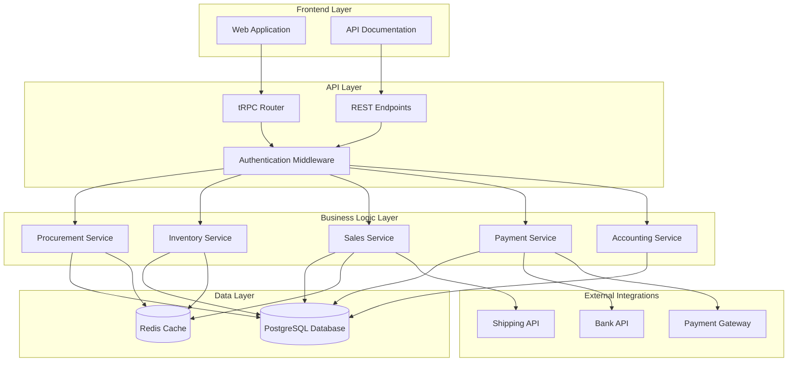
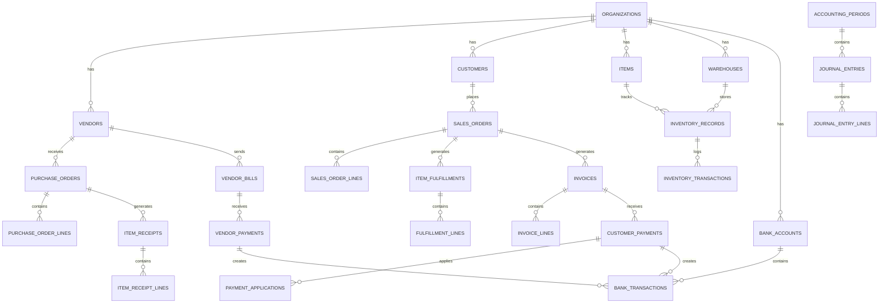
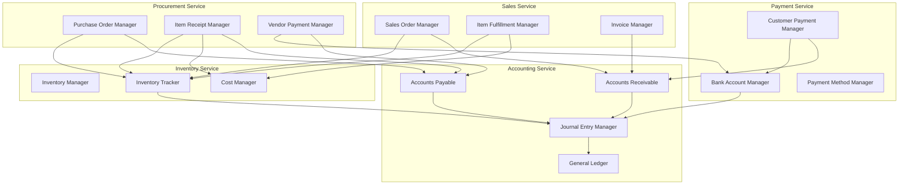

# System Architecture for Order-to-Cash Process

## High-Level Architecture



## Database Schema Overview



## Service Layer Architecture



## API Structure

### tRPC Routers
```typescript
// Main router structure
const appRouter = router({
  // Existing routers
  customers: customersRouter,
  vendors: vendorsRouter,
  items: itemsRouter,
  warehouses: warehousesRouter,
  
  // New order-to-cash routers
  purchaseOrders: purchaseOrdersRouter,
  itemReceipts: itemReceiptsRouter,
  inventory: inventoryRouter,
  salesOrders: salesOrdersRouter,
  fulfillments: fulfillmentsRouter,
  invoices: invoicesRouter,
  payments: paymentsRouter,
  bankAccounts: bankAccountsRouter,
  accounting: accountingRouter,
});
```

### Key API Endpoints
```typescript
// Purchase Orders
purchaseOrders: {
  list: publicProcedure.query(),
  create: publicProcedure.mutation(),
  update: publicProcedure.mutation(),
  delete: publicProcedure.mutation(),
  approve: publicProcedure.mutation(),
  receive: publicProcedure.mutation(),
}

// Sales Orders
salesOrders: {
  list: publicProcedure.query(),
  create: publicProcedure.mutation(),
  update: publicProcedure.mutation(),
  fulfill: publicProcedure.mutation(),
  invoice: publicProcedure.mutation(),
}

// Inventory
inventory: {
  getAvailability: publicProcedure.query(),
  getTransactions: publicProcedure.query(),
  adjustQuantity: publicProcedure.mutation(),
  getValuation: publicProcedure.query(),
}

// Payments
payments: {
  processCustomerPayment: publicProcedure.mutation(),
  processVendorPayment: publicProcedure.mutation(),
  getBankBalance: publicProcedure.query(),
}
```

## Security Considerations

### Authentication & Authorization
- JWT-based authentication via Clerk
- Role-based access control (RBAC)
- Organization-level data isolation
- API rate limiting
- Audit logging for all transactions

### Data Privacy
- PII encryption at rest
- Secure payment processing
- Bank account number masking
- Financial data access controls

## Performance Considerations

### Caching Strategy
- Redis for session management
- Query result caching for inventory
- Price list caching
- Bank balance caching

### Database Optimization
- Proper indexing on foreign keys
- Partitioning for large transaction tables
- Read replicas for reporting
- Connection pooling

## Monitoring & Observability

### Key Metrics
- API response times
- Database query performance
- Payment processing success rates
- Inventory accuracy
- Order fulfillment times

### Alerting
- Failed payments
- Low inventory alerts
- High-value transaction notifications
- System health checks

## Disaster Recovery

### Backup Strategy
- Daily database backups
- Point-in-time recovery
- Cross-region replication
- Transaction log shipping

### Business Continuity
- Failover procedures
- Data integrity checks
- Recovery time objectives (RTO: 4 hours)
- Recovery point objectives (RPO: 1 hour)