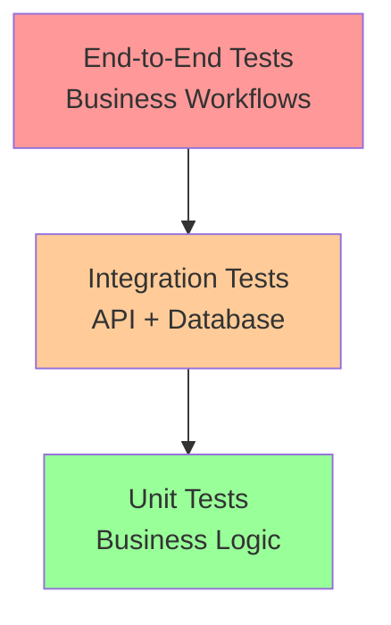

# TDD Implementation Plan - Order to Cash System

## Test-Driven Development Approach

### Philosophy
- **API First**: Design and test APIs before implementation
- **Red-Green-Refactor**: Write failing tests, implement minimal code, refactor
- **End-to-End Testing**: Full workflow tests for business processes
- **Contract Testing**: Ensure API contracts are maintained

## Testing Strategy

### Test Pyramid


### Test Categories

#### 1. Unit Tests (70%)
- Business logic validation
- Service layer methods
- Utility functions
- Validation schemas

#### 2. Integration Tests (20%)
- tRPC API endpoints
- Database operations
- Service interactions
- Authentication flows

#### 3. End-to-End Tests (10%)
- Complete business workflows
- Multi-entity operations
- Cross-service communication
- User journey validation

## Implementation Phases

### Phase 1: Foundation & Core Entities (Week 1)

#### Database Schema Tests
```typescript
// Example test structure
describe('Database Schema', () => {
  describe('Purchase Orders', () => {
    it('should create purchase order table with correct constraints')
    it('should enforce foreign key relationships')
    it('should have proper indexes for performance')
  })
})
```

#### Core Entity Tests
```typescript
describe('Purchase Order Entity', () => {
  it('should validate required fields')
  it('should calculate total amount correctly')
  it('should enforce business rules')
  it('should track status transitions')
})
```

### Phase 2: Procurement System (Week 2)

#### API Contract Tests
```typescript
describe('Purchase Orders API', () => {
  describe('POST /api/purchase-orders', () => {
    it('should create purchase order with valid data')
    it('should reject invalid vendor ID')
    it('should enforce organization isolation')
    it('should return correct response format')
  })
  
  describe('GET /api/purchase-orders', () => {
    it('should return paginated results')
    it('should filter by status')
    it('should sort by creation date')
  })
})
```

#### Business Logic Tests
```typescript
describe('Purchase Order Service', () => {
  it('should approve purchase order when under limit')
  it('should require approval for large orders')
  it('should prevent modification of approved orders')
  it('should calculate tax correctly')
})
```

### Phase 3: Inventory Management (Week 3)

#### Inventory Tests
```typescript
describe('Inventory Management', () => {
  it('should increase quantity on item receipt')
  it('should decrease quantity on fulfillment')
  it('should prevent negative inventory')
  it('should calculate FIFO cost basis')
  it('should track lot numbers when enabled')
})
```

### Phase 4: Sales System (Week 4)

#### Sales Order Tests
```typescript
describe('Sales Orders API', () => {
  it('should create sales order with price list pricing')
  it('should validate customer credit limit')
  it('should check inventory availability')
  it('should apply discounts correctly')
})
```

### Phase 5: Fulfillment & Invoicing (Week 5)

#### Fulfillment Tests
```typescript
describe('Item Fulfillment', () => {
  it('should create fulfillment from sales order')
  it('should update inventory quantities')
  it('should prevent over-fulfillment')
  it('should generate tracking numbers')
})
```

### Phase 6: Payment Processing (Week 6)

#### Payment Tests
```typescript
describe('Payment Processing', () => {
  it('should process customer payment')
  it('should update invoice status')
  it('should create bank transaction')
  it('should handle partial payments')
})
```

### Phase 7: End-to-End Workflows (Week 7)

#### Complete Workflow Tests
```typescript
describe('Order to Cash Workflow', () => {
  it('should complete full procurement cycle')
  it('should complete full sales cycle')
  it('should handle payment processing')
  it('should maintain accounting integrity')
})
```

## Test Infrastructure Setup

### Jest Configuration
```javascript
// jest.config.js
module.exports = {
  preset: 'ts-jest',
  testEnvironment: 'node',
  setupFilesAfterEnv: ['<rootDir>/tests/setup.ts'],
  testMatch: ['**/__tests__/**/*.test.ts'],
  collectCoverageFrom: [
    'src/**/*.ts',
    '!src/**/*.d.ts',
    '!src/migrations/**',
  ],
  coverageThreshold: {
    global: {
      branches: 80,
      functions: 80,
      lines: 80,
      statements: 80,
    },
  },
};
```

### Test Database Setup
```typescript
// tests/setup.ts
import { db } from '../src/lib/db';
import { migrate } from 'drizzle-orm/postgres-js/migrator';

beforeAll(async () => {
  // Run migrations on test database
  await migrate(db, { migrationsFolder: './migrations' });
});

afterEach(async () => {
  // Clean up test data
  await db.transaction(async (tx) => {
    // Truncate tables in reverse dependency order
    await tx.execute('TRUNCATE purchase_order_lines, purchase_orders CASCADE');
    await tx.execute('TRUNCATE sales_order_lines, sales_orders CASCADE');
    // ... etc
  });
});
```

### Mock Services
```typescript
// tests/mocks/services.ts
export const mockPaymentService = {
  processPayment: jest.fn(),
  validatePaymentMethod: jest.fn(),
  calculateFees: jest.fn(),
};

export const mockInventoryService = {
  checkAvailability: jest.fn(),
  reserveItems: jest.fn(),
  updateQuantities: jest.fn(),
};
```

## API-First Design Process

### 1. Define API Contract
```typescript
// schemas/purchase-orders.ts
export const createPurchaseOrderSchema = z.object({
  vendorId: z.string().uuid(),
  expectedDate: z.date(),
  items: z.array(z.object({
    itemId: z.string().uuid(),
    quantity: z.number().positive(),
    unitCost: z.number().positive(),
  })),
  notes: z.string().optional(),
});

export type CreatePurchaseOrderInput = z.infer<typeof createPurchaseOrderSchema>;
```

### 2. Write API Tests
```typescript
// __tests__/api/purchase-orders.test.ts
describe('Purchase Orders API', () => {
  it('should create purchase order', async () => {
    const input: CreatePurchaseOrderInput = {
      vendorId: 'vendor-123',
      expectedDate: new Date('2024-01-15'),
      items: [
        { itemId: 'item-123', quantity: 10, unitCost: 25.50 }
      ],
    };

    const result = await caller.purchaseOrders.create(input);
    
    expect(result).toMatchObject({
      id: expect.any(String),
      vendorId: input.vendorId,
      status: 'DRAFT',
      totalAmount: 255.00,
    });
  });
});
```

### 3. Implement API Endpoint
```typescript
// routers/purchase-orders.ts
export const purchaseOrdersRouter = router({
  create: publicProcedure
    .input(createPurchaseOrderSchema)
    .mutation(async ({ input, ctx }) => {
      const purchaseOrder = await purchaseOrderService.create(input, ctx.orgId);
      return purchaseOrder;
    }),
});
```

### 4. Implement Service Logic
```typescript
// services/purchase-order-service.ts
export class PurchaseOrderService {
  async create(input: CreatePurchaseOrderInput, orgId: string) {
    // Business logic implementation
    // This passes the tests we wrote
  }
}
```

## Test Data Management

### Test Factories
```typescript
// tests/factories/purchase-order.factory.ts
export const createPurchaseOrderFactory = (overrides = {}) => ({
  vendorId: 'vendor-123',
  expectedDate: new Date(),
  status: 'DRAFT',
  items: [
    { itemId: 'item-123', quantity: 1, unitCost: 10.00 }
  ],
  ...overrides,
});
```

### Database Seeders
```typescript
// tests/seeders/base-data.seeder.ts
export async function seedBaseData() {
  const org = await createOrganization({ name: 'Test Org' });
  const vendor = await createVendor({ name: 'Test Vendor', orgId: org.id });
  const customer = await createCustomer({ name: 'Test Customer', orgId: org.id });
  const item = await createItem({ name: 'Test Item', orgId: org.id });
  
  return { org, vendor, customer, item };
}
```

## Continuous Integration

### GitHub Actions Workflow
```yaml
# .github/workflows/test.yml
name: Tests
on: [push, pull_request]

jobs:
  test:
    runs-on: ubuntu-latest
    services:
      postgres:
        image: postgres:15
        env:
          POSTGRES_PASSWORD: postgres
        options: >-
          --health-cmd pg_isready
          --health-interval 10s
          --health-timeout 5s
          --health-retries 5
    
    steps:
      - uses: actions/checkout@v3
      - uses: actions/setup-node@v3
        with:
          node-version: '18'
      
      - run: npm ci
      - run: npm run test:unit
      - run: npm run test:integration
      - run: npm run test:e2e
      
      - name: Upload coverage
        uses: codecov/codecov-action@v3
```

## Success Metrics

### Coverage Targets
- **Unit Tests**: 90% code coverage
- **Integration Tests**: 80% API endpoint coverage
- **E2E Tests**: 100% critical workflow coverage

### Quality Gates
- All tests must pass before merge
- No new code without tests
- Performance tests for critical paths
- Security tests for authentication/authorization

## Next Steps

1. **Set up test infrastructure** (Jest, test database, factories)
2. **Create first entity tests** (Purchase Orders)
3. **Implement database schema** (following TDD)
4. **Build API endpoints** (test-first)
5. **Add business logic** (service layer)
6. **Create E2E workflows** (complete processes)

Ready to start with the test infrastructure setup?