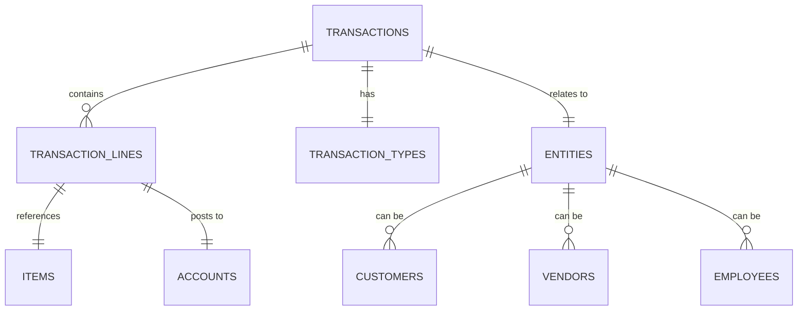

# Transaction-Based Design Pattern

## Overview

All business documents (Purchase Orders, Sales Orders, Estimates, Invoices, Bills, etc.) follow the same transaction pattern with different entity relationships and workflows.

## Generic Transaction Structure



## Transaction Types

| Transaction Type | Entity Type | Direction | Purpose |
|-----------------|-------------|-----------|---------|
| SALES_ORDER | Customer | Outbound | Customer wants to buy |
| ESTIMATE | Customer | Outbound | Quote for customer |
| INVOICE | Customer | Outbound | Bill customer |
| PURCHASE_ORDER | Vendor | Inbound | We want to buy |
| VENDOR_BILL | Vendor | Inbound | Vendor bills us |
| EXPENSE_REPORT | Employee | Internal | Employee expenses |
| INVENTORY_ADJUSTMENT | Internal | Internal | Adjust inventory |

## Database Schema

### Core Transaction Table
```sql
CREATE TABLE transactions (
  id UUID PRIMARY KEY DEFAULT gen_random_uuid(),
  organization_id UUID NOT NULL REFERENCES organizations(id),
  transaction_type VARCHAR(50) NOT NULL,
  transaction_number VARCHAR(100) NOT NULL,
  entity_id UUID, -- References customers, vendors, or employees
  entity_type VARCHAR(20), -- 'CUSTOMER', 'VENDOR', 'EMPLOYEE', 'INTERNAL'
  
  -- Status and workflow
  status VARCHAR(50) NOT NULL DEFAULT 'DRAFT',
  workflow_stage VARCHAR(50),
  
  -- Dates
  transaction_date DATE NOT NULL,
  due_date DATE,
  expected_date DATE,
  
  -- Financial totals
  subtotal DECIMAL(15,2) NOT NULL DEFAULT 0,
  tax_amount DECIMAL(15,2) NOT NULL DEFAULT 0,
  discount_amount DECIMAL(15,2) NOT NULL DEFAULT 0,
  total_amount DECIMAL(15,2) NOT NULL DEFAULT 0,
  
  -- References
  reference_transaction_id UUID REFERENCES transactions(id),
  external_reference VARCHAR(255),
  
  -- Metadata
  notes TEXT,
  terms TEXT,
  created_at TIMESTAMP DEFAULT CURRENT_TIMESTAMP,
  updated_at TIMESTAMP DEFAULT CURRENT_TIMESTAMP,
  created_by UUID,
  approved_by UUID,
  approved_at TIMESTAMP,
  
  UNIQUE(organization_id, transaction_number),
  INDEX(organization_id, transaction_type),
  INDEX(entity_id, entity_type),
  INDEX(status),
  INDEX(transaction_date)
);
```

### Transaction Lines Table
```sql
CREATE TABLE transaction_lines (
  id UUID PRIMARY KEY DEFAULT gen_random_uuid(),
  transaction_id UUID NOT NULL REFERENCES transactions(id) ON DELETE CASCADE,
  line_number INTEGER NOT NULL,
  
  -- Item details
  item_id UUID REFERENCES items(id),
  description TEXT NOT NULL,
  
  -- Quantities and pricing
  quantity DECIMAL(15,4) NOT NULL DEFAULT 0,
  unit_price DECIMAL(15,2) NOT NULL DEFAULT 0,
  discount_percent DECIMAL(5,2) DEFAULT 0,
  discount_amount DECIMAL(15,2) DEFAULT 0,
  line_total DECIMAL(15,2) NOT NULL DEFAULT 0,
  
  -- Accounting
  account_id UUID REFERENCES accounts(id),
  tax_code VARCHAR(50),
  tax_amount DECIMAL(15,2) DEFAULT 0,
  
  -- Inventory tracking
  warehouse_id UUID REFERENCES warehouses(id),
  lot_number VARCHAR(100),
  serial_number VARCHAR(100),
  
  -- Metadata
  notes TEXT,
  created_at TIMESTAMP DEFAULT CURRENT_TIMESTAMP,
  updated_at TIMESTAMP DEFAULT CURRENT_TIMESTAMP,
  
  UNIQUE(transaction_id, line_number),
  INDEX(transaction_id),
  INDEX(item_id),
  INDEX(warehouse_id)
);
```

## Status Workflows

### Purchase Order Workflow
```
DRAFT → SENT → APPROVED → PARTIALLY_RECEIVED → FULLY_RECEIVED → CLOSED
```

### Sales Order Workflow
```
DRAFT → SENT → CONFIRMED → PARTIALLY_FULFILLED → FULLY_FULFILLED → INVOICED → CLOSED
```

### Estimate Workflow
```
DRAFT → SENT → VIEWED → ACCEPTED → CONVERTED_TO_ORDER
                  ↘ DECLINED → CLOSED
```

### Invoice Workflow
```
DRAFT → SENT → PARTIALLY_PAID → FULLY_PAID → CLOSED
```

## API Design

### Generic Transaction Router
```typescript
export const transactionsRouter = router({
  // Generic CRUD operations
  list: publicProcedure
    .input(z.object({
      transactionType: z.enum(['SALES_ORDER', 'PURCHASE_ORDER', 'ESTIMATE', 'INVOICE']),
      status: z.string().optional(),
      entityId: z.string().optional(),
      page: z.number().default(1),
      limit: z.number().default(20),
    }))
    .query(async ({ input, ctx }) => {
      return await transactionService.list(input, ctx.orgId);
    }),

  create: publicProcedure
    .input(createTransactionSchema)
    .mutation(async ({ input, ctx }) => {
      return await transactionService.create(input, ctx.orgId);
    }),

  // Transaction-type specific operations
  approve: publicProcedure
    .input(z.object({ id: z.string() }))
    .mutation(async ({ input, ctx }) => {
      return await transactionService.approve(input.id, ctx.orgId);
    }),

  // Workflow transitions
  updateStatus: publicProcedure
    .input(z.object({ 
      id: z.string(), 
      status: z.string(),
      notes: z.string().optional()
    }))
    .mutation(async ({ input, ctx }) => {
      return await transactionService.updateStatus(input, ctx.orgId);
    }),
});
```

### Specialized Routers (for convenience)
```typescript
// Purchase Orders - specialized view of transactions
export const purchaseOrdersRouter = router({
  list: publicProcedure.query(async ({ ctx }) => {
    return await transactionsRouter.list({ 
      transactionType: 'PURCHASE_ORDER' 
    }, ctx);
  }),

  create: publicProcedure
    .input(purchaseOrderSchema)
    .mutation(async ({ input, ctx }) => {
      return await transactionsRouter.create({
        ...input,
        transactionType: 'PURCHASE_ORDER',
        entityType: 'VENDOR'
      }, ctx);
    }),
});

// Sales Orders - specialized view of transactions
export const salesOrdersRouter = router({
  list: publicProcedure.query(async ({ ctx }) => {
    return await transactionsRouter.list({ 
      transactionType: 'SALES_ORDER' 
    }, ctx);
  }),

  create: publicProcedure
    .input(salesOrderSchema)
    .mutation(async ({ input, ctx }) => {
      return await transactionsRouter.create({
        ...input,
        transactionType: 'SALES_ORDER',
        entityType: 'CUSTOMER'
      }, ctx);
    }),
});
```

## Service Layer Pattern

```typescript
export class TransactionService {
  async create(input: CreateTransactionInput, orgId: string) {
    return await db.transaction(async (tx) => {
      // Validate entity belongs to organization
      await this.validateEntity(input.entityId, input.entityType, orgId);
      
      // Generate transaction number
      const transactionNumber = await this.generateTransactionNumber(
        input.transactionType, 
        orgId
      );
      
      // Calculate totals
      const totals = this.calculateTotals(input.lines);
      
      // Create transaction
      const transaction = await tx.insert(transactions).values({
        organizationId: orgId,
        transactionType: input.transactionType,
        transactionNumber,
        entityId: input.entityId,
        entityType: input.entityType,
        ...totals,
        ...input
      }).returning();
      
      // Create transaction lines
      const lines = await tx.insert(transactionLines).values(
        input.lines.map((line, index) => ({
          transactionId: transaction[0].id,
          lineNumber: index + 1,
          ...line
        }))
      ).returning();
      
      return { ...transaction[0], lines };
    });
  }

  async updateStatus(input: UpdateStatusInput, orgId: string) {
    // Validate status transition
    const transaction = await this.getById(input.id, orgId);
    this.validateStatusTransition(transaction.status, input.status, transaction.transactionType);
    
    // Update status
    const updated = await db.update(transactions)
      .set({ 
        status: input.status,
        updatedAt: new Date(),
        ...(input.status === 'APPROVED' && { approvedAt: new Date() })
      })
      .where(and(
        eq(transactions.id, input.id),
        eq(transactions.organizationId, orgId)
      ))
      .returning();
      
    // Trigger side effects based on status change
    await this.handleStatusChange(updated[0], input.status);
    
    return updated[0];
  }

  private validateStatusTransition(currentStatus: string, newStatus: string, transactionType: string) {
    const workflows = {
      PURCHASE_ORDER: ['DRAFT', 'SENT', 'APPROVED', 'PARTIALLY_RECEIVED', 'FULLY_RECEIVED', 'CLOSED'],
      SALES_ORDER: ['DRAFT', 'SENT', 'CONFIRMED', 'PARTIALLY_FULFILLED', 'FULLY_FULFILLED', 'INVOICED', 'CLOSED'],
      // ... other workflows
    };
    
    const validStatuses = workflows[transactionType];
    const currentIndex = validStatuses.indexOf(currentStatus);
    const newIndex = validStatuses.indexOf(newStatus);
    
    if (newIndex <= currentIndex && newStatus !== currentStatus) {
      throw new TRPCError({
        code: 'BAD_REQUEST',
        message: `Cannot transition from ${currentStatus} to ${newStatus}`
      });
    }
  }
}
```

## Benefits of This Approach

1. **Code Reuse**: Same logic for all transaction types
2. **Consistency**: Uniform API patterns across all document types
3. **Flexibility**: Easy to add new transaction types
4. **Maintainability**: Single place for transaction logic
5. **Reporting**: Unified transaction history across all types
6. **Workflow Management**: Consistent status management

## Migration Strategy

1. Create generic `transactions` and `transaction_lines` tables
2. Migrate existing specific tables (purchase_orders, sales_orders) to generic structure
3. Update APIs to use generic transaction service
4. Keep specialized routers for backward compatibility
5. Gradually migrate frontend to use unified transaction components

This pattern allows us to handle Purchase Orders, Sales Orders, Estimates, Invoices, Bills, and any future transaction types with the same underlying infrastructure while maintaining type-specific business rules and workflows.